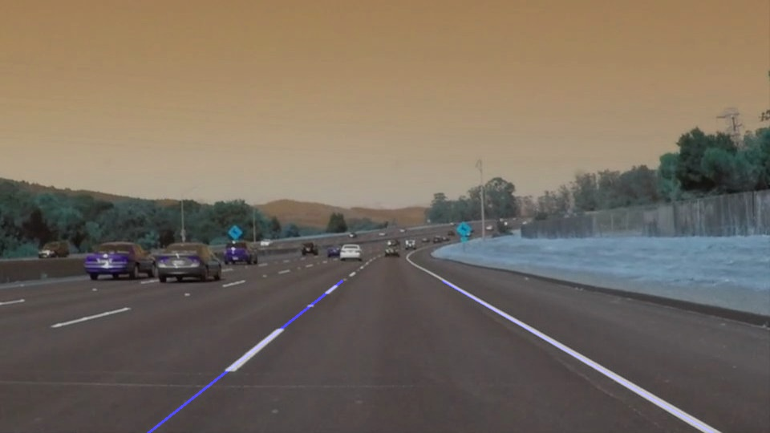
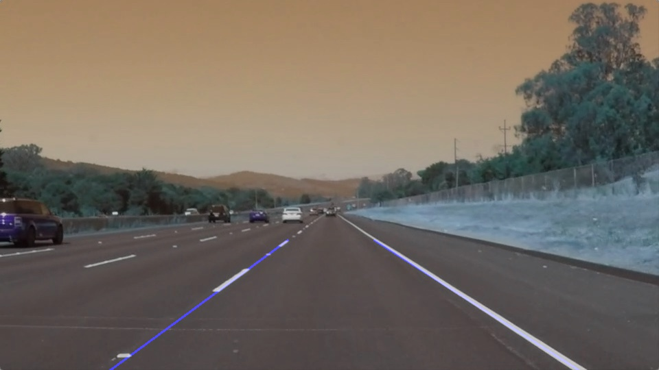
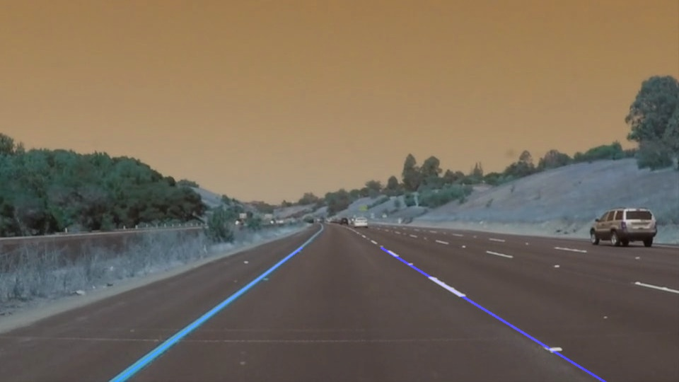
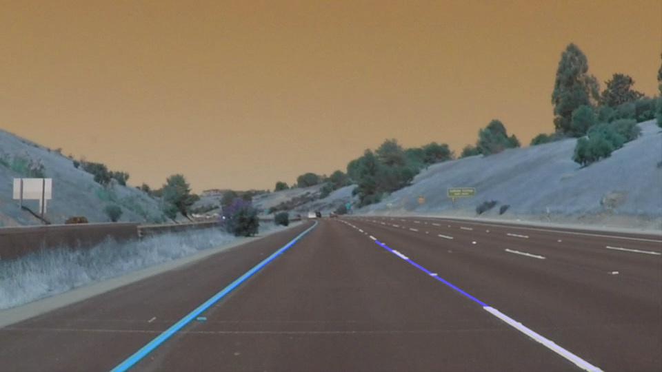
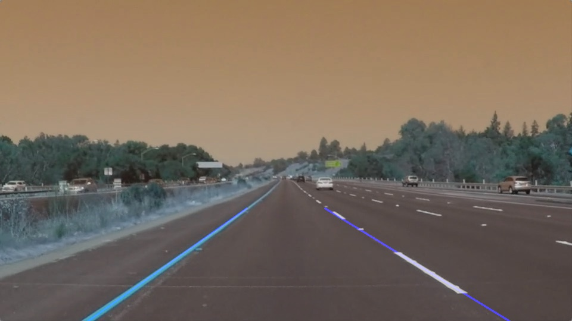
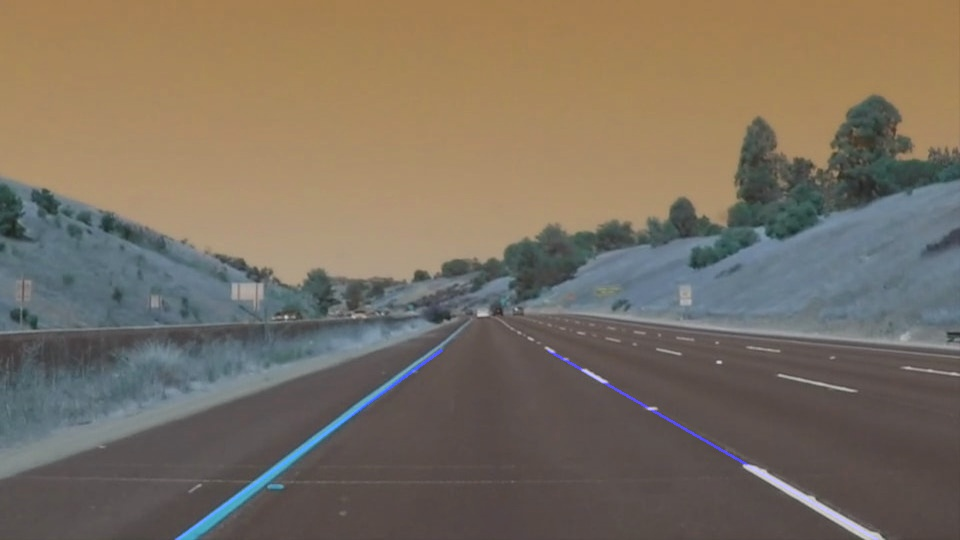

# **Finding Lane Lines on the Road** 

## Project Writeup

### This writeup presents the method, challenges and process used to complete the finding lane lines project by implementing computer vision algorithms and tools.

---

**Finding Lane Lines on the Road**

The goals / steps of this project are the following:
* Make a pipeline that finds lane lines on the road
* Examine the pipeline accross multiple images to ensure it performs as expected
* Implement the pipeline in video files
* Reflect on your work in a written report

[//]: # (Image References)

[image1]: ./examples/grayscale.jpg "Grayscale"

---

### Reflection

### 1. Describe your pipeline. As part of the description, explain how you modified the draw_lines() function.

My pipeline consisted of 5 steps. 

First, I converted the images to grayscale using the provided grayscale function, then I pre-processed the image for edge detection by passing it through a blurring filter. A Gaussian filter was used. In order to determine the filter parameters I designed a graphics based tunning (GBT) tool which allowed me vary parameters of the filter and visually observe the output. The third step was to carry out Canny Edge detection on the blurred image. The GBT tool was also used to identify the values of the parameters of the edge detecton function. 
The result of Edge detection is presented in [image1]: ./image_output/EdgeDetected.jpg "Edge Detection"

Subsequently, region of interest was isolated by masking the edge-detected image with a 4-cornered polygon. The 4-cornered polygon was constructed by identifying region of interest in the image.  The isolated image is presented in [image2]:  

The Hough_lines function designed using the HoughLinesP tool was used to identify group of points that form lines. The values of the parameters was selected by observing their effects using the GBT tool.

In order to draw a single line on the left and right lanes, I created a draw_lines_2() function by first testing for flat lines and eliminating them. Then testing for lines on the right of the lane and then testing for lines on the left on the lane. Due to the difference in the image coordinates (origin at top left instead of origin at bottom left), positive gradient represented lines on the right and negative gradients represent lines on the left.

As advised, I proceeded to average the points of the lines on the left and right and then extrapolated them near to the center of the image plane (which was roughly where the lanes end). 

Finally, the image with extrapolated lines was placed on the original image using the weighted_img function and the default paramenter.

The performance of the pipeline was tested using all the sample images provided and it proved to work adequately as shown below.

[image3]:  
[image4]:  
[image5]:  
[image6]:  
[image7]:  
[image8]:  

### 1b. Challenges faced during the project
First challenge I faced was finding the average of extrapolated lines instead of extrapolating the average of the points. Finding the average of extrapolated lines made the pipeline fail and the video was always messed up.

Another challenge was identifying the end point for extrapolation. Initially I used the mid point of the image plane but this led to intersection of lane lines which is practically impossible. To prevent this, I included a 'compensation' variable as discussed below.

### 2. Identify potential shortcomings with your current pipeline

One potential shortcoming would be what would happen when the lines curves or bends, the straight line doesnt follow the bend

Another shortcoming could be when the road is almost same colour as the lanes, it would be difficult to differentiate

### 3. Suggest possible improvements to your pipeline

A possible improvement would be to use a curved function maybe a second degree polynomial to extrapolate points so a to stay on the curve. However, what I did was to linearize the curves by isolating the linear region of the lanes. I took the end of lane before the curves by defining a 'compensation' variable for this.

Another potential improvement could be tune the threshold values to always separate road from lanes.
